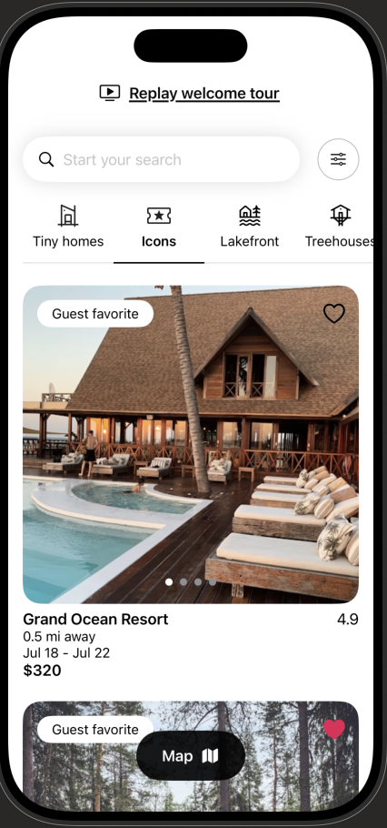
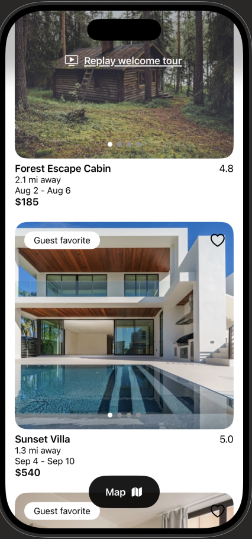
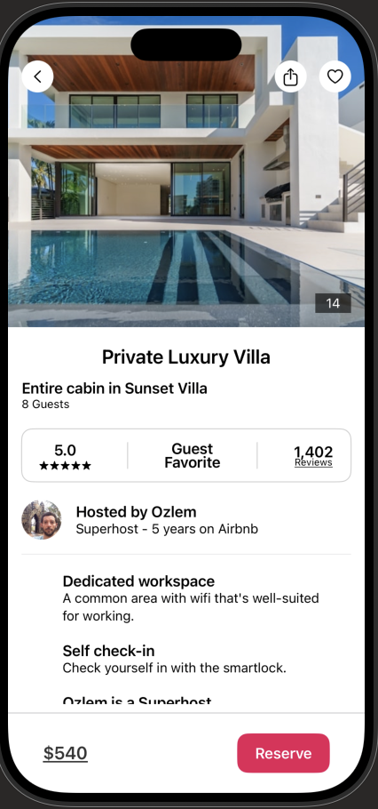
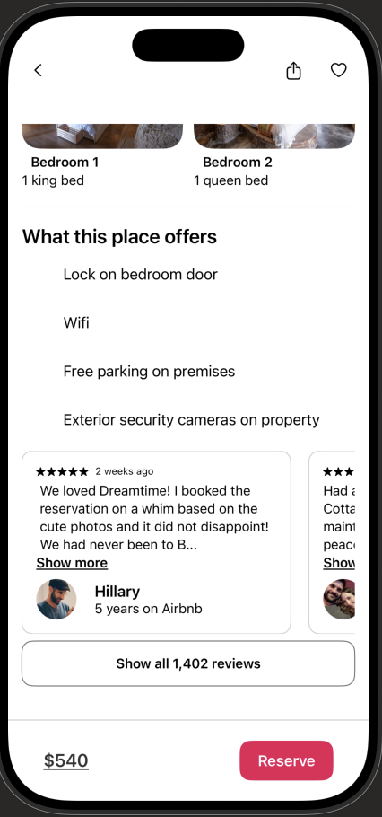
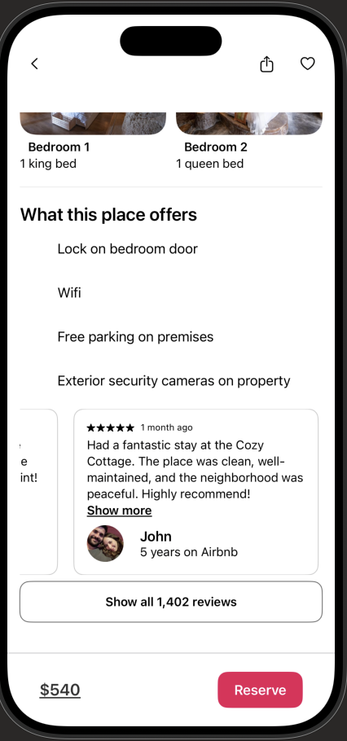

# 🏠 AirbnbSwiftUI

A pixel-perfect Airbnb UI clone built entirely with **SwiftUI**, recreating the look and feel of the real app — from the explore feed to the listing detail experience.


## 📱 Screenshots

| Explore | Listings | Detail |
|:---:|:---:|:---:|
|  |  |  |

| Amenities | Reviews |
|:---:|:---:|
|  |  |

## ✨ Features

- **Explore feed** with search bar, category filter tabs (Tiny homes, Icons, Lakefront, Treehouses) and scrollable listing cards
- **Image carousels** on every listing card with paging indicators
- **Guest favorite badges** and wishlist heart button with like state
- **Floating Map button** overlay on the feed
- **Listing detail view** with full-screen photo gallery, ratings summary, host section and Superhost badge
- **Amenities section** ("What this place offers")
- **Horizontally scrollable reviews carousel** with reviewer avatars
- **Sticky reservation bar** with price and Reserve button

## 🛠 Tech Stack

- **SwiftUI** — 100% declarative UI, no UIKit
- **MVVM** architecture
- **TabView & ScrollView** compositions for carousels and feeds
- **SF Symbols** for iconography

## 🚀 Getting Started

1. Clone the repo
   ```bash
   git clone https://github.com/alex-hort/AirbnbSwiftUI.git
   ```
2. Open `Airbnb.xcodeproj` in Xcode 15 or later
3. Build & run on an iOS 17+ simulator or device

## 👨‍💻 Author

**Alex** — [GitHub](https://github.com/alex-hort)

---

⭐️ If you like this project, give it a star!
